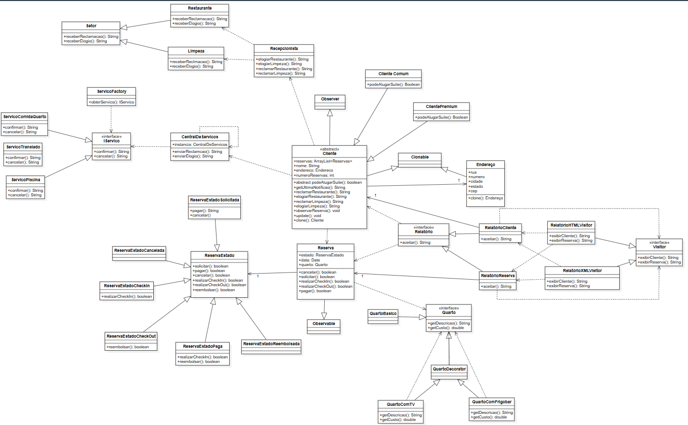
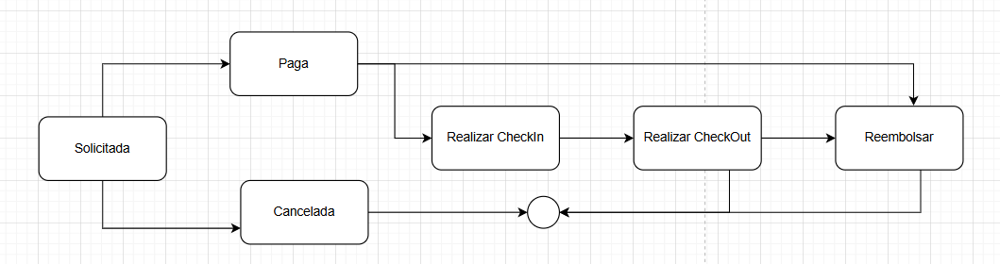

# Gerenciador de Hotel

Trabalho final em Java da disciplina de Aspectos Avançados em Engenharia de Software da Universidade Federal de Juiz de fora.

Os padrões escolhidos foram: Template Method, Decorator, Observer, State, Mediator, Factory Method, Singleton e Visitor. Além do Prototype, como padrão não estudado durante a disciplina.

**Todos os testes estão na pasta Test.**

# Diagrama de classes

# Diagrama de estados

